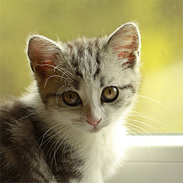

# starolchen.github.io
<!DOCTYPE html>
<html lang="en">

  <head>
    <meta charset="utf-8" />
      <title>The Cat House</title>
    <link rel="stylesheet" type="text/css" href="midterm.css" />
  </head>

  <body>
    <header id="header">
      

        

          <h2>(^._.^)The cat house</h2>
        

        <nav id="main-menu">
          <h3 class="hidden">Main menu</h3>
          <ul>
            <li><a href="midterm.html">Home</a></li>
            <li><a href="#">Breeds</a></li>
            <li><a href="#">Articles</a></li>
            <li><a href="#">Adopt</a></li>
            <li><a href="#">About</a></li>
          </ul>
        </nav>
        

          

            

              <h1 class="banner-title">Hello, there!</h1>
              
              

            

          

      
 <!-- end page wrapper -->
    </header>

    

      <main id="main">
          

            <h3>Interested about cat?</h3>
            
Well, you've come to the right place. Explore, <a href="#">learn</a>, have fun!

            
Join the community.

            <form action="#">
              <button class="button1">Create an account now</button>
            </form>
          

          

            <h3>Learn about cat</h3>
              

                
<a href="#">Breeds</a>

                
                
Learn about different cat breeds.

                <form action="#">
                  <button class="button2">Read about breeds</button>
                </form>
              

              

                
<a href="#">Find a cat</a>

                
                
Help a cat find a home.

                <form action="#">
                  <button class="button2">Adopt a cat</button>
                </form>
              

          

          

            <form id="user-info">
              <h3>Stay up to date</h3>
              
Get the lastest cat-related and tips about by subscribing to our newsletters

              

                

                  <label for="username">Name</label>
                  <input type="text" id="username" name="username" placeholder="John Smith">
                

                

                  <label for="username">Email</label>
                  <input type="text" id="email" name="email" placeholder="john.smith@example.com">
                

              

              

                <fieldset id="tips">
                  <legend>Get tips related to</legend>
                  

                    <input type="checkbox" id="adopt-box" name="adopt-box" value="a">
                    <label for="adopt-box">Cat adoption</label>
                    <input type="checkbox" id="toys-box" name="toys-box" value="t">
                    <label for="toys-box">Cat toys</label>
                    <input type="checkbox" id="care-box" name="care-box" value="c">
                    <label for="care-box">Cat care</label>
                  

                </fieldset>
              

              
<button class="button3" type="submit" id="register" name="register">Subscribe now</button>

            </form>
          

        </main>
      

    <footer id="footer">
      

      <nav id="sub-menu">
        <h3 class="hidden">Sub navigation</h3>
        <ul class="main-subnav">
          <li><a href="#">Breeds</a></li>
          <li><a href="#">Adopt</a></li>
          <li><a href="#">About</a></li>
          <li><a href="#">Legal</a></li>
        </ul>
        <ul>
          <li><a href="#">Search by name</a></li>
          <li><a href="#">How to adopt</a></li>
          <li> </li>
          <li><a href="#">Term and conditions</a></li>
        </ul>
        <ul>
          <li><a href="#">Search by charateristic</a></li>
          <li><a href="#">Find a cat today</a></li>
          <li> </li>
          <li><a href="#">Private policy</a></li>
        </ul>
      </nav>
        

          
&copy;Copyright The Cat House,2021. All right reserved. This is a fake website for HTTP5104.

        

      

    </footer>
  </body>
</html>
